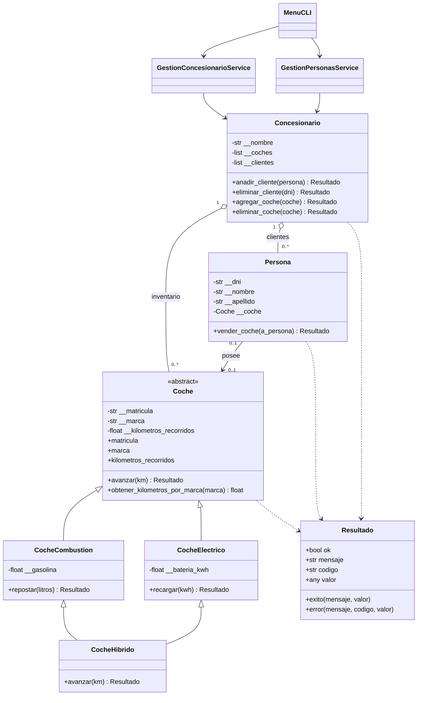
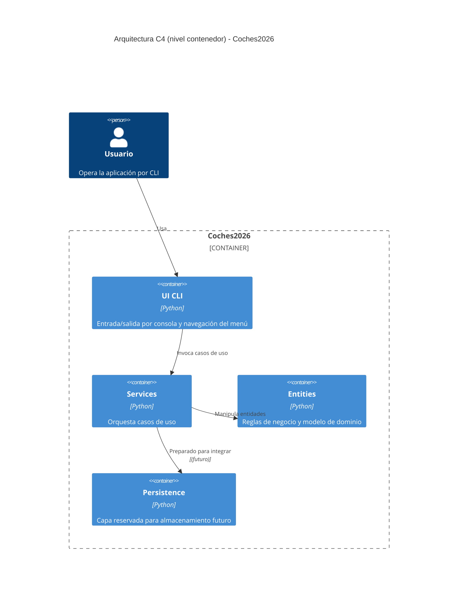

# Coches2026

Aplicación de consola para gestionar coches, personas clientes y un concesionario, con separación por capas (`entities`, `services`, `ui`, `persistence`) y contrato uniforme de errores mediante `Resultado`.

## Objetivo del proyecto

Este repositorio implementa un dominio académico de concesionario con foco en:

- modelado orientado a objetos y encapsulación
- herencia y polimorfismo (`Coche` abstracta y sus variantes)
- reglas de negocio explícitas sin `print()` en dominio/servicios
- arquitectura por capas con dependencias dirigidas (`ui -> services -> entities`)

La especificación funcional detallada está en `PRD.md`.

## Requisitos

- Python 3.12 o superior
- `pytest` para ejecutar tests

## Instalación rápida

```bash
python3 -m venv .venv
source .venv/bin/activate
python -m pip install -U pip pytest
```

> Nota: `pyproject.toml` existe, pero actualmente está vacío. Por eso `pytest` se instala explícitamente.

## Cómo ejecutar la aplicación

```bash
python main.py
```

`main.py` construye dependencias base y arranca `MenuCLI` (`ui/menu.py`).

## Flujo disponible en la CLI

Menú principal (`ui/menu.py`):

1. Alta cliente
2. Alta coche (`combustion`, `electrico`, `hibrido`)
3. Transferir coche entre clientes por DNI
4. Ver resumen de concesionario
0. Salir

## Reglas de dominio más importantes

- `Coche` centraliza la lógica común de avance y acumulación de kilómetros por marca (`entities/coche.py`).
- `CocheCombustion` consume `0.05` litros/km (`entities/coche_combustion.py`).
- `CocheElectrico` consume `0.02` kWh/km (`entities/coche_electrico.py`).
- `CocheHibrido` usa herencia múltiple real y prioriza batería; no mezcla fuentes en una misma llamada a `avanzar(km)` (`entities/coche_hibrido.py`).
- `Persona` puede tener como máximo un coche y valida transferencias (`entities/persona.py`).
- `Concesionario` gestiona clientes por DNI y coches por matrícula; soporta `+`, `-`, `+=`, `-=` con semántica de copia/mutación (`entities/concesionario.py`).
- Operaciones que pueden fallar devuelven `Resultado` (`entities/resultado.py`).

## Arquitectura y estructura

```text
Coches2026/
├── entities/      # Dominio puro: entidades y reglas de negocio
├── services/      # Casos de uso / orquestación
├── ui/            # CLI delgada
├── persistence/   # Reservado para persistencia futura
├── tests/         # Tests de dominio
└── main.py        # Punto de entrada
```

### Responsabilidades por capa

Regla arquitectónica: `ui` solo depende de `services`; `ui` no puede importar `entities` (flujo permitido: `ui -> services -> entities`).

- `entities/`: invariantes, estado y comportamiento de negocio.
- `services/`: coordinación entre entidades para casos de uso (sin I/O de consola).
- `ui/`: traducción entrada/salida del usuario.
- `persistence/`: preparada para evolucionar a almacenamiento real.

## Ejecutar tests

```bash
python -m pytest -q
```

El conjunto actual (`tests/test_entities.py`) cubre casos clave: avance por tipo de coche, prioridad de híbrido, transferencia entre personas, operadores de concesionario y acumulación por marca.

## Ejemplo rápido de uso en código

```python
from src.entities import CocheHibrido

coche = CocheHibrido("3333CCC", "Toyota")
coche.recargar(2)
resultado = coche.avanzar(50)

print(resultado.ok, resultado.mensaje, resultado.valor)
print(coche.kilometros_recorridos)
```

## Diagrama UML de clases (Mermaid)



## Diagrama de arquitectura C4 (Mermaid)



## Estado actual y evolución

- Persistencia real aún no implementada (`persistence/__init__.py` placeholder).
- Para directrices de trabajo con agentes AI, revisar `AGENTS.md`.

